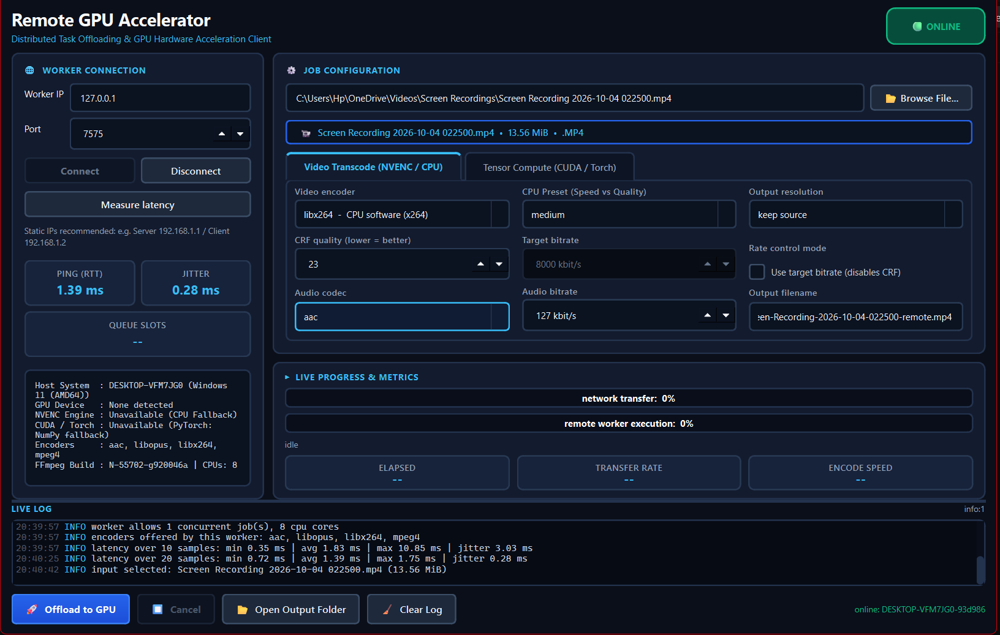
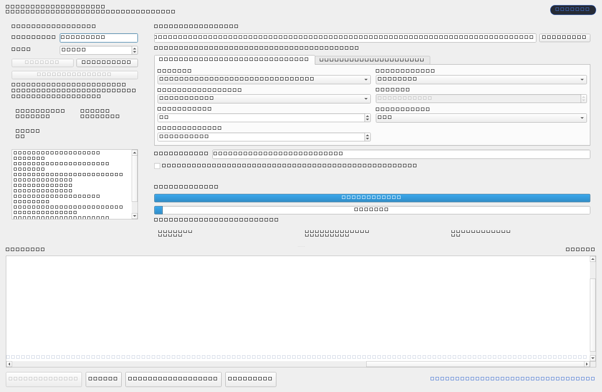
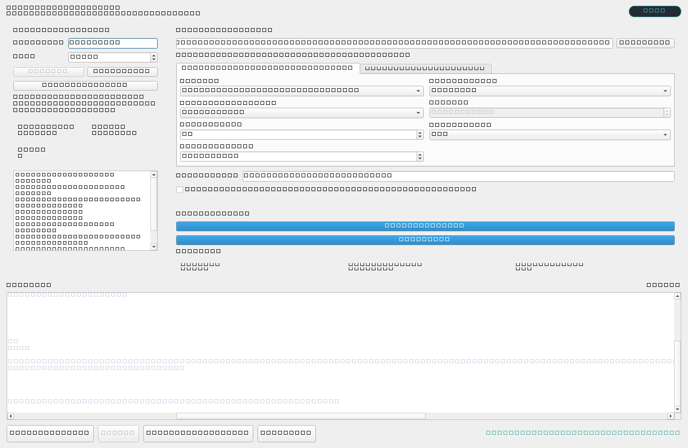
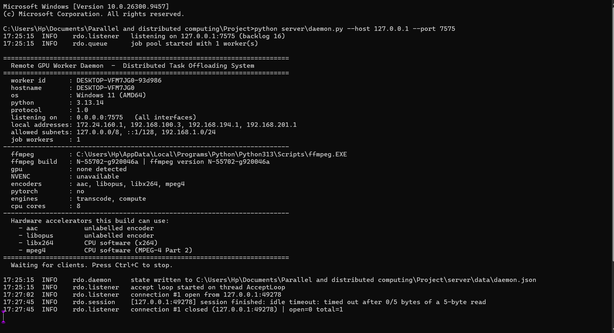
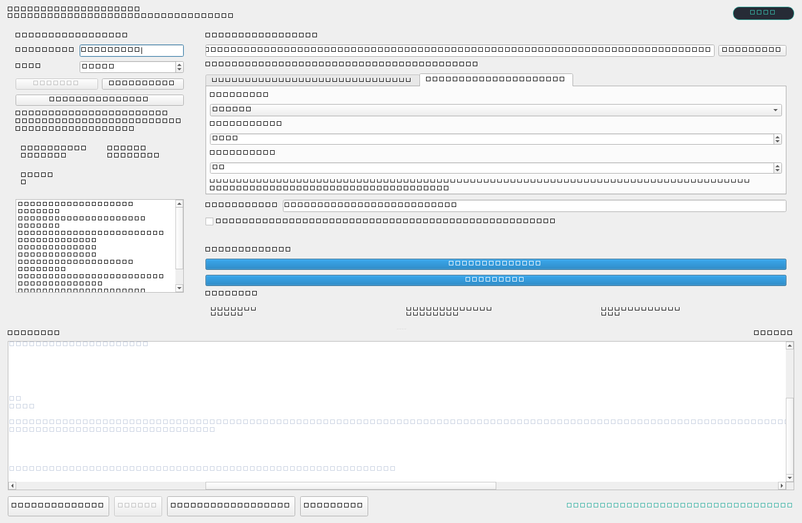
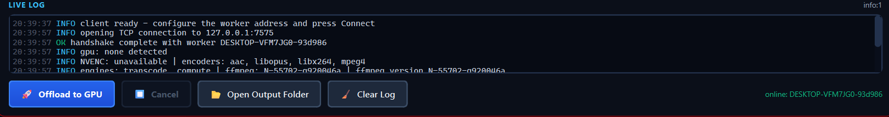

# Distributed Task Offloading and Remote Rendering

Offload video transcoding and numeric compute from a laptop to a GPU worker over
a plain TCP connection, with a dark-themed PyQt6 client, a threaded worker
daemon, a bounded job queue, live progress, and checksum-verified transfers.

```
   client laptop                                          GPU worker
   +-----------------------------+                +-----------------------------+
   |  PyQt6 GUI                  |                |  server/daemon.py           |
   |    worker on a QThread      |   length-      |    accept loop (independent)|
   |      upload -> job -> fetch |  prefixed TCP  |    session thread + writer |
   +-----------------------------+  frames, 7575 +    job pool -> ffmpeg/torch  |
                                                          storage + checksums
```

## Quick start

On the **worker** (the machine with the GPU):

```powershell
pip install -r requirements.txt
python server\daemon.py
```

On the **client**:

```powershell
pip install -r requirements.txt
python client\app.py --host 192.168.1.1 --port 7575
```

Connect, pick a file, press Submit. The worker encodes, the client shows
progress, and the result is downloaded and verified.

For two machines with no DHCP, see `docs/NETWORK.md` - it includes a PowerShell
helper that assigns static addresses on both sides.

## What it does

* **Capability negotiation** - the client asks what the worker can do (FFmpeg
  build, GPU, NVENC, CUDA, PyTorch, encoders) before a job is built, and will
  not submit an encoder the worker lacks.
* **Streaming upload** - raw bytes with SHA-256 on both sides, staged through a
  `.part` file so an interrupted transfer can never be mistaken for a complete
  one.
* **Bounded job queue** - `--workers N` caps concurrency; cancellation is honoured
  even for jobs that have not started.
* **Live progress** - monotonic, rate-limited frames that cannot jump backwards.
* **Verified download** - 256 KiB chunks, hashed as they are written, promoted to
  the final name only after the digest matches.
* **Compute jobs** - `matmul`, `conv2d`, `transformer_ffn`, `elementwise` on
  Torch/CUDA when available and NumPy otherwise, with JSON metrics output.
* **Graceful degradation** - no GPU means `libx264`, not a failed job. Old
  FFmpeg builds are handled, not rejected.
* **Measurement** - `tools/bench.py` reports end-to-end speedup, compute-only
  speedup and network overhead separately, so offloading is never made to look
  free.

## Screenshots & Visual Walkthrough

### 1. Connected Client & Hardware Capability Negotiation
The PyQt6 client connects over TCP, negotiates hardware acceleration capabilities (NVENC, CUDA, CPU encoders), tracks live network latency and jitter, and configures the transcoding profile.



### 2. Live Task Offloading & Dual Progress Streaming
Streaming architecture tracks simultaneous progress: upload/download transmission and remote FFmpeg worker execution, with live transfer rates and elapsed time.



### 3. Verified Task Completion & Automatic Download
Completed outputs stream back in framed chunks, undergoing end-to-end SHA-256 verification before final promotion to local storage.



<details>
<summary><b>Click to view Worker Daemon, Tensor Compute, and Log Console</b></summary>

<br>

#### 4. Worker Daemon Initialized
Threaded daemon running on port 7575, probing GPU/CPU acceleration, detecting encoders, and running the accept loop.



#### 5. Tensor Compute Offloading (CUDA / NumPy)
Offloading numeric compute workloads (matrix multiplication, 2D convolutions, transformer feed-forward) with benchmark timings.



#### 6. Structured Diagnostic Log Terminal
Embedded log console with level-coded syntax highlighting (`OK`, `INFO`, `WARN`, `ERROR`) for protocol tracing.



</details>

## Layout

```
common/     protocol framing, message types, validation, checksums, constants
server/     daemon, accept loop, session state machine, queue + pool, storage,
            capability probing, ffmpeg and compute engines
client/     GUI, Qt worker wrapper, synchronous transport
tools/      benchmark harness, network probe, sample media, network setup
tests/      184 tests, all runnable without a GPU
docs/       PRD, architecture, protocol, network, testing
screenshots/ captured from the running app by tools/screenshots.py
benchmarks/ measured results (RESULTS.md) and the raw JSON
```

## Commands

| Purpose | Command |
|---|---|
| Run the worker | `python server\daemon.py --host 0.0.0.0 --workers 2` |
| Run the client | `python client\app.py --host 192.168.1.1` |
| Build test clips | `python tools\make_sample_media.py --all` |
| Build a large clip | `python tools\make_sample_media.py --preset 1080p --seconds 10 --hq` |
| Probe the link | `python tools\probe_network.py --host 192.168.1.1 --port 7600` |
| Benchmark | `python tools\bench.py --host 192.168.1.1 --all --repeat 3` |
| Test | `python -m pytest tests -q` |
| Screenshots | `python tools\screenshots.py` |

## Requirements

Python 3.11+, PyQt6, NumPy, FFmpeg on `PATH` (or `RDO_FFMPEG`). PyTorch is
optional and only needed for real GPU compute numbers. See
`requirements.txt`.

## Measured results

`benchmarks/RESULTS.md` has the full table and the reasoning. The short version:
on a CPU-only worker reachable over loopback, offloading measures **0.83x** - a
clear loss, which is the correct result when there is no faster machine to move
the work to. GPU numbers require the lab hardware and are marked pending rather
than estimated.

## Documentation

| Document | Contents |
|---|---|
| `docs/PRD.md` | goals, functional and non-functional requirements, acceptance criteria |
| `docs/ARCHITECTURE.md` | threading model, module map, storage layout, failure handling |
| `docs/PROTOCOL.md` | frame layout, every frame type, handshake, upload, download, limits |
| `docs/NETWORK.md` | static IPs, firewall, measuring the link, troubleshooting table |
| `docs/TESTING.md` | what is covered, which tests catch which class of bug |
| `REPORT.md` | the write-up: design decisions, results, limitations |
